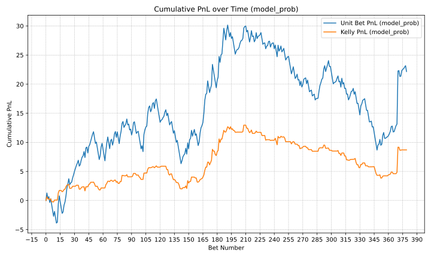

This repository is dedicated to publishing ex-ante predictions (with probability estimates) for tennis matches using a graph neural network model.

The model is currently stored in a private repository with commit hash: 0cf9599df962333a3b42bf6b1546816e720b2b4b

This repository will serve as a demonstration of our model, with no possiblity of lookahead-bias, for the forthcoming paper:

[Tennis match outcome prediction using temporal directed graph neural networks](https://research-information.bris.ac.uk/en/publications/tennis-match-outcome-prediction-using-temporal-directed-graph-neu),

available at [11th MathSport International Conference Proceedings 2025](https://math.uni.lu/midas/events/mathsports2025/).

**Final Results**:
| Model       | Accuracy | Brier Score | ROI (Unit) | ROI (Kelly) |
|-------------|----------|-------------|------------|-------------|
| PS     | 0.691    | 0.198       | -0.024 | 0.000  |
| GNN  | 0.641    | 0.225       | 0.058      | 0.023       |
| WElo   | 0.646    | 0.214       | 0.007      | 0.010       |
| Bradley Terry     | 0.639    | 0.223       | 0.006      | 0.010       |

## File description
*   `README.md`: This file, providing an overview of the project.
*   `preds.csv`: CSV file containing **all model predictions.**
*   `data/`: Directory containing data files.
    *   `pnl_3masters.svg`: SVG image file, displaying cumulative profit and loss (PNL).
    *   `atp.csv`: Training data, updated at end of each tournament.
    *   `atp3tourns.csv`: Matches from the first 3 tournaments.
    *   `men.csv`: Player features, to be used for node features.
*   `helpers/`: Directory containing helper scripts.
    *   `evaluate_predictions.py`: Script for calculating accuracy statistics and profit and loss.
    *   `merge.py`: Script to merge new atp data with prediction file.
    *   `update_preds_with_ps.py`: Script to update preds.csv with ps_prob calculated from PSA and PSB.

## preds.csv Description

- A and B state players names with random assignment.
- Awin: contains binary indicators of whether A won or not (1 or 0).
- PSA and PSB: The listed odds from Pinnacle Sports for players A and B respectively. Odds are obtained from [tennis-data.co.uk](tennis-data.co.uk).
- ps_prob: The odds-implied probability for player A, estimated using Shin's method [[3](#3), [4](#4)].
- model_prob: Our model's estimated probability for player A to win against player B.
- welo_prob: The probability of player A winning against player B calculated with Weighted Elo [[1](#1)].
- bt_prob: The probability of player A winning against player B calculated with a Bradley Terry model [[2](#2)].

## Tournaments 

The predictions will cover every main-draw event from [all Grand Slam and ATP Masters 1000 tournaments held on Clay courts](https://en.wikipedia.org/wiki/2025_ATP_Tour) starting with the Monte-Carlo Masters and ending with the French Open, also known as Roland-Garros:

1. **Monte Carlo Masters (ATP Masters 1000)**: April 6 - April 13, 2025
2. **Madrid Open (ATP Masters 1000)**: April 21 - May 4, 2025
3. **Rome Masters (ATP Masters 1000)**: May 7 - May 18, 2025
4. **Roland Garros (Grand Slam)**: May 25 - June 8, 2025

## Features

- **Match Predictions**: We will provide forecasts for upcoming tennis matches, including probability estimates for each outcome.
- **Live Updates**: New predictions will be published before each tournament round, ensuring no lookahead bias.
- **CSV Format**: Predictions will be saved in the easily accesible CSV format.

## Updates

Updates will be committed ad-hoc, with probabilities, Kelly stakes, and outcomes updated at different times. Importantly though, our probability estimates will always be published ex-ante. 

Our betting model will be detailed fully in our published work, so we state simply here:

- **Unit**: Bet on the player the model determines as the favourite (probablity>0.5), irrespective of bookmaker odds. Bets are all equally sized at 0.1 units.
- **Kelly**: Bet on the player the model determines as the favourite (probability>0.5), only if the estimated probalility exceed that of the 1/o, where o is the decimal bookmaker odds for the favourite. The stake size is determined by the Kelly criterion.

## Usage

Feel free to access the CSV files to view predictions and track the model's performance over time. As the repository is updated, you will be able to see the latest predictions and accuracy metrics.

Stay tuned for the public release of the model.

# References

<a id="1">[1]</a> [G. Angelini, V. Candila, L. De Angelis, “Weighted Elo rating for tennis match predictions”. European Journal of Operational Research, 2022, 297, pp. 120-132.](https://doi.org/10.1016/j.ejor.2021.04.011)

<a id="2">[2]</a> [R. A. Bradley, M. E. Terry, “Rank analysis of incomplete block designs: I. The method of paired comparisons”. Biometrika, 1952, 39, pp. 324-345.](https://doi.org/10.1093/biomet/39.3-4.324)

<a id="3">[3]</a> 
[H. S. Shin, “Prices of State Contingent Claims with Insider
traders, and the Favorite-Longshot Bias”. The Economic
Journal, 1992, 102, pp. 426-435.](https://doi.org/10.2307/2234526)

<a id="4">[4]</a> 
[H. S. Shin, “Measuring the Incidence of Insider Trading in a
Market for State-Contingent Claims”. The Economic Journal,
1993, 103(420), pp. 1141-1153.](https://doi.org/10.2307/2234240)
